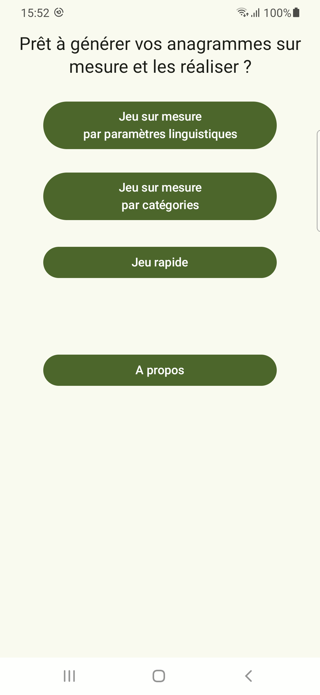
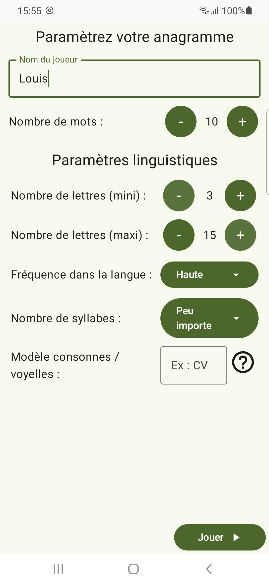
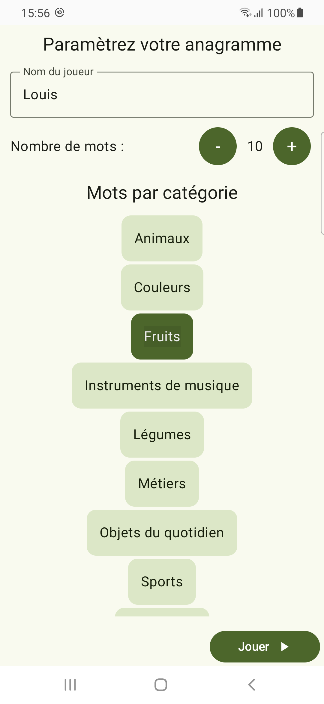
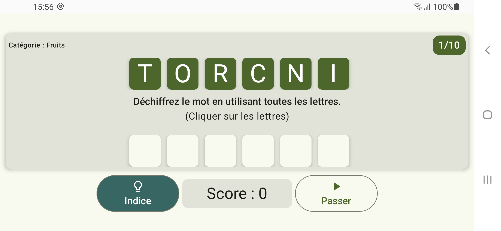
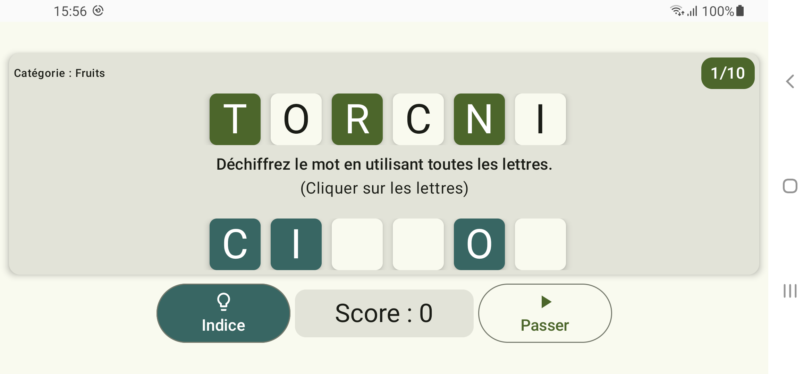
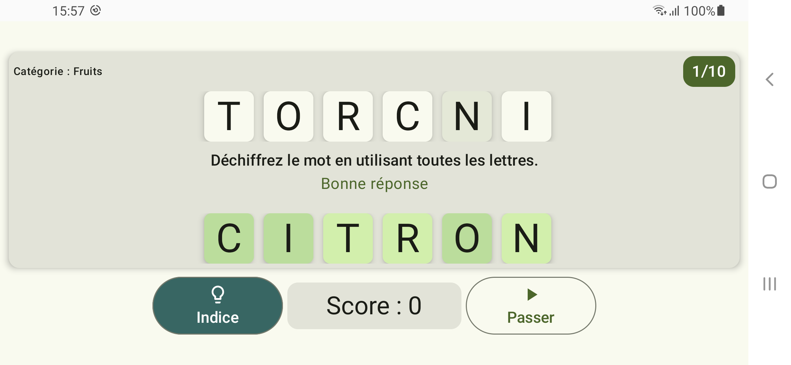

 

# Application "Anagrammes sur mesure" en cours de test sur le Google Play Store

« Anagrammes sur mesure » est un jeu d'anagrammes qui vous permet de personnaliser votre expérience de jeu selon des critères linguistiques spécifiques ou des catégories de mots. 

Conçue pour offrir un défi stimulant et amusant aux amateurs de mots, l’application offre une approche unique en combinant la puissance de la personnalisation avec une interface intuitive et accessible. 

Elle est destinée à toute les personnes appréciant jouer avec les mots. Plus particulièrement, elle propose aux amateurs de scrabble un entraînement précis et adapté à leurs besoins. 

Elle peut également être utilisée par les orthophonistes auprès de leurs patients (adolescents/adultes) afin d'entraîner l'évocation lexicale et la flexibilité mentale. 

Personnalisation selon des critères linguistiques : 

- Le nombre de lettres et nombres de syllabes : ce qui permet de s’adapter à tous les niveaux, des débutants aux experts en anagrammes

- La fréquence des mots dans la langue, vous permettant de choisir des mots plus ou moins fréquents, selon vos envies.

- La complexité structurelle du mot (l'enchaînement des consonnes et des voyelles).

Ces options de personnalisation permettent de créer une expérience de jeu unique, en fonction de vos objectifs d’apprentissage ou de votre simple désir de challenge.

Personnalisation selon la catégorie des mots :

Anagrammes sur mesure offre la possibilité de choisir des catégories de mots pour chaque session. Cela ajoute un aspect ludique et éducatif, en vous permettant d’apprendre de nouveaux mots tout en jouant.
Lancement rapide du jeu :

Pour ceux qui souhaitent se lancer immédiatement dans une partie sans configuration préalable, un mode de lancement rapide est disponible. 

Accessibilité :
Anagrammes sur mesure a été conçu en tenant compte de l'accessibilité pour tous les utilisateurs. L’application est compatible avec les fonctionnalités d'accessibilité des appareils mobiles, telles que TalkBack pour les utilisateurs malvoyants, ainsi que des polices de caractères ajustables et un contraste élevé pour une meilleure lisibilité. Les commandes sont intuitives, permettant une navigation fluide pour les personnes avec des besoins spécifiques en matière d’accessibilité.
Anagrammes sur mesure est l'outil idéal pour un entrainement cérébral en vous amusant, seul ou entre amis. Grâce à sa personnalisation poussée et à son interface accessible, cette application de jeu d'anagrammes saura captiver tous les amoureux des mots. Téléchargez-la dès maintenant et commencez à résoudre vos anagrammes !

## Technologies
- Jetpack Compose
- Kotlin
- Room

## Concepts

- Pattern : MVVM
- Tests : Instrumentés
- Accessibilité : Validation d'Accessibility Scanner + tests manuels avec TalkBack
- UI : portrait, paysage, téléphone et tablette, mode clair et sombre

## Impressions d'écran

	
	
	

	

	
	
	

